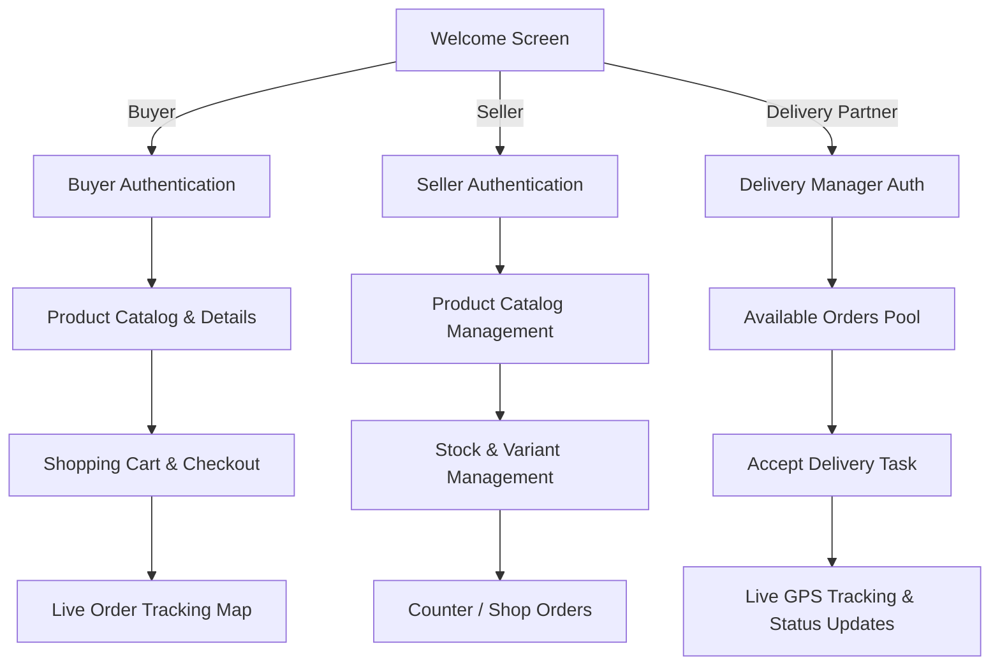
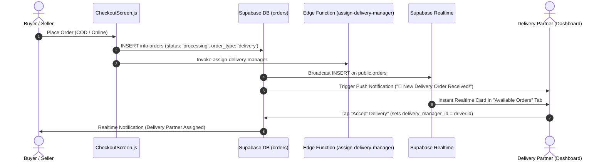
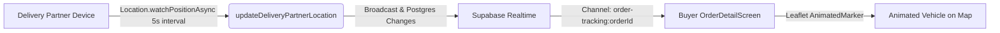

# 📦 Multi-Role Commerce & Live Delivery Tracking System

This document outlines the **end-to-end architecture, role-based user flows, authentication processes, and real-time delivery pipeline** for the application.

---

## 📑 Table of Contents
1. [Multi-Role Architecture](#1-multi-role-architecture)
2. [Authentication & Profile Sync](#2-authentication--profile-sync)
3. [Order State Lifecycle & When Delivery Managers Get the Order](#3-order-state-lifecycle--when-delivery-managers-get-the-order)
4. [Order Creation & Automatic Delivery Hit Pipeline](#4-order-creation--automatic-delivery-hit-pipeline)
5. [Delivery Partner Operations](#5-delivery-partner-operations)
6. [Live GPS Location Tracking](#6-live-gps-location-tracking)
7. [Database Schema & Migrations](#7-database-schema--migrations)
8. [Screens & File Reference](#8-screens--file-reference)

---

## 1. Multi-Role Architecture

The platform supports 3 primary user roles, each with dedicated authentication, interfaces, and permissions:



| Role | Role Identifier | Primary Screens | Core Capabilities |
| :--- | :--- | :--- | :--- |
| **Buyer / Customer** | `'customer'` | `CatalogScreen`, `ProductDetailScreen`, `CartScreen`, `CheckoutScreen`, `OrderDetailScreen` | Browse products, manage cart, place delivery/shop orders, track delivery vehicle live on interactive map. |
| **Seller / Merchant** | `'seller'` | `DashboardScreen`, `ProductScreen`, `ProductFormModal`, `OrderEditScreen` | Manage products & variants, adjust inventory, view sales, process counter/dine-in/parcel orders. |
| **Delivery Partner** | `'delivery_manager'` | `DeliveryManagerDashboard`, `OrderDetailScreen` | Receive real-time delivery requests, claim/accept orders, navigate to customer with GPS, update delivery status, broadcast live location. |

---

## 2. Authentication & Profile Sync

### A. Authentication Methods
- **Email & Password**: Dedicated login and signup forms for Buyer, Seller, and Delivery Manager.
- **Google One-Tap / OAuth**: Direct social login with auto-linking to the Supabase auth session.

### B. Auto-Profile Creation Trigger
When an account is created in `auth.users`, a PostgreSQL trigger (`handle_new_user`) automatically provisions or updates the corresponding row in `public.profiles`:

```sql
-- Trigger extracts metadata cleanly
user_role := COALESCE(NEW.raw_user_meta_data->>'role', 'customer');
full_name := COALESCE(NEW.raw_user_meta_data->>'full_name', split_part(NEW.email, '@', 1));
```

### C. Guest Cart Migration
When a guest buyer adds products to their cart without logging in, the items are stored locally. Upon signing up or logging in, `mergeGuestCart(userId)` automatically merges the guest items into the database-backed cart in Supabase.

---

## 3. Order State Lifecycle & When Delivery Managers Get the Order

### A. When Does the Delivery Partner Get the Order?
The Delivery Manager receives and is alerted about the order **immediately upon creation** (while in the **`processing`** or **`pending`** state). They do **not** need to wait for a seller to manually change the status to `shipped`.

### B. State Transition Diagram

```mermaid
stateDiagram-v2
    [*] --> Processing: 1. Order Placed by Buyer / Seller
    note right of Processing: Delivery Managers receive the order IMMEDIATELY in "Available Orders" tab
    
    Processing --> Claimed: 2. Driver taps "Accept Delivery"
    note right of Claimed: Assigned to driver, moves to "My Tasks"

    Claimed --> OutForDelivery: 3. Driver picks up & taps "Start Delivery"
    note right of OutForDelivery: Live GPS tracking activates for Customer Map

    OutForDelivery --> Completed: 4. Driver hands over & taps "Mark as Delivered"
    note right of Completed: Moves to "History" tab
```



### C. State Progression & Responsibility Matrix

| Stage / State | Who Triggers It? | System Action | Delivery Manager Interface & Action |
| :--- | :--- | :--- | :--- |
| **1. `processing` / `pending`** *(Created)* | **Buyer** (via Checkout) or **Seller** | Order is saved to database. Push notifications and Realtime events are broadcast to all online delivery managers immediately. | The order appears in the **Available Orders** tab. Any delivery manager can review the address, items, and total price, then tap **"Accept Delivery"**. |
| **2. `Processing` / `Assigned`** *(Claimed)* | **Delivery Partner** | `delivery_manager_id` is updated to the driver's ID (`auth.uid()`), locking it so other drivers cannot claim it. | The order moves into the driver's **My Tasks** tab. The driver can tap **Directions** to navigate to the pickup/customer location or tap **Call**. |
| **3. `Out for Delivery`** *(In Transit)* | **Delivery Partner** (or Seller) | Live GPS location broadcasting turns on (`watchPositionAsync`), streaming live coordinates every 5 seconds. | Driver taps **"Start Delivery"**. The buyer's screen shows an animated vehicle moving along the route on the Leaflet map. |
| **4. `Completed`** *(Delivered)* | **Delivery Partner** | Delivery is finalized, payment collected (if COD), and completion timestamp is recorded. | Driver taps **"Mark as Delivered"**. The order moves into the **History** tab. |

---

## 4. Order Creation & Automatic Delivery Hit Pipeline

When an order is placed by a **Buyer** (online delivery) or **Seller** (customer delivery), the system automatically triggers delivery partner notifications and dispatch:



### Detailed Pipeline Steps:
1. **Order Insertion**: `CheckoutScreen.js` inserts into `public.orders` with shipping address, total amount, and `status: 'processing'`.
2. **Edge Function Trigger**: `supabase.functions.invoke('assign-delivery-manager')` executes in Deno:
   - If shipping address has GPS coordinates (`latitude`, `longitude`), it invokes `find_nearest_manager(order_lat, order_lon)` to find the closest driver.
   - If GPS coordinates are not provided, it finds available delivery managers from `profiles`.
3. **Database Push Notification Trigger**:
   - `on_new_delivery_order_notify_managers` runs on PostgreSQL insert.
   - Extracts push tokens from `push_tokens` for all active delivery managers.
   - Dispatches Expo push notifications: `🛵 New Delivery Order Received! Order #1234 (₹450) is ready for pickup.`
4. **Realtime Broadcast**:
   - `orders` table is in `supabase_realtime` publication.
   - All connected Delivery Manager dashboards receive the payload in milliseconds.

---

## 5. Delivery Partner Operations

The **Delivery Manager Dashboard** (`src/screens/DeliveryManagerDashboard.js`) offers a 3-tab workflow:

### Tab 1: Available Orders (`Available`)
- Real-time pool of unassigned incoming orders from Buyers & Sellers.
- Displays: Order Number, Customer Name, Full Address, Total Price, Item Count, and Timestamp.
- **Actions**:
  - `Details`: View full order items and customer request.
  - `Accept Delivery`: Instantly assigns order to the driver, updates status to `Processing`, and shifts card to "My Tasks".

### Tab 2: My Tasks (`My Tasks`)
- Active deliveries assigned to the current driver.
- **Quick Action Tools**:
  - 🗺️ **Directions**: One-tap launch into Google Maps / Apple Maps using customer GPS coordinates or address string.
  - 📞 **Call**: One-tap phone dialer to contact the customer.
  - 🚚 **Start Delivery**: Updates order status to `Out for Delivery` and starts high-accuracy live GPS location broadcast.
  - ✅ **Mark as Delivered**: Completes the order (`status: 'Completed'`).

### Tab 3: History (`History`)
- Completed past delivery log for auditing and earnings reference.

---

## 5. Live GPS Location Tracking



1. **Background / Foreground Watcher**:
   - `expo-location` tracks delivery partner GPS (`latitude`, `longitude`, `heading`, `speed`) every 5 seconds or 10 meters.
2. **Realtime Broadcast**:
   - Location is pushed to `delivery_partner_locations` and broadcast via channel `order-tracking:${orderId}`.
3. **Buyer Map View**:
   - `OrderDetailScreen.js` displays an interactive OpenStreetMap / Leaflet map via `react-native-webview`.
   - `window.updateMarkerLocation(lat, lon)` smoothly moves the vehicle marker along the route to the delivery address.

---

## 6. Database Schema & Migrations

The database setup requires executing two idempotent SQL migration scripts in the **Supabase SQL Editor**:

### Migration 1: Auth & Profiles Fix (`fix_auth_triggers_and_profiles.sql`)
- Ensures `profiles` contains: `id`, `full_name`, `email`, `mobile`, `role`, `avatar_url`, `push_token`, etc.
- Converts empty string mobile numbers to `NULL` to avoid unique key collisions.
- Sets up safe RLS policies for `profiles`.
- Creates crash-proof `handle_new_user()` trigger with `EXCEPTION` safety.

### Migration 2: Realtime & Delivery Triggers (`setup_delivery_manager_realtime_and_notifications.sql`)
- Adds `orders` and `delivery_partner_locations` to `supabase_realtime` publication.
- Configures RLS policies allowing delivery managers to view and claim available orders.
- Attaches `on_new_delivery_order_notify_managers` trigger on `public.orders`.
- Attaches `on_order_assigned_notify_delivery_manager` trigger on assignment update.

---

## 7. Screens & File Reference

| File | Purpose |
| :--- | :--- |
| [`src/screens/BuyerLoginScreen.js`](file:///workspaces/needsTracking/src/screens/BuyerLoginScreen.js) | Buyer email/password & Google login with redirect support |
| [`src/screens/BuyerSignupScreen.js`](file:///workspaces/needsTracking/src/screens/BuyerSignupScreen.js) | Buyer registration with guest cart migration |
| [`src/screens/DeliveryManagerLoginScreen.js`](file:///workspaces/needsTracking/src/screens/DeliveryManagerLoginScreen.js) | Delivery partner login & profile sync |
| [`src/screens/DeliveryManagerSignupScreen.js`](file:///workspaces/needsTracking/src/screens/DeliveryManagerSignupScreen.js) | Delivery partner account creation |
| [`src/screens/DeliveryManagerDashboard.js`](file:///workspaces/needsTracking/src/screens/DeliveryManagerDashboard.js) | Available orders, active tasks, maps navigation, order status controls |
| [`src/screens/OrderDetailScreen.js`](file:///workspaces/needsTracking/src/screens/OrderDetailScreen.js) | Detailed order view with live Leaflet map tracking & receipt printing |
| [`src/screens/CheckoutScreen.js`](file:///workspaces/needsTracking/src/screens/CheckoutScreen.js) | Cart checkout, payment selection, delivery order creation & driver dispatch |
| [`src/services/supabase.js`](file:///workspaces/needsTracking/src/services/supabase.js) | Supabase client API, authentication, order queries, and location updates |
| [`supabase/functions/assign-delivery-manager/index.ts`](file:///workspaces/needsTracking/supabase/functions/assign-delivery-manager/index.ts) | Edge Function for nearest manager geo-assignment & push notifications |
| [`fix_auth_triggers_and_profiles.sql`](file:///workspaces/needsTracking/fix_auth_triggers_and_profiles.sql) | SQL script: crash-proof auth signup trigger and profiles schema |
| [`setup_delivery_manager_realtime_and_notifications.sql`](file:///workspaces/needsTracking/setup_delivery_manager_realtime_and_notifications.sql) | SQL script: delivery RLS policies, realtime publication, and notification triggers |

---
